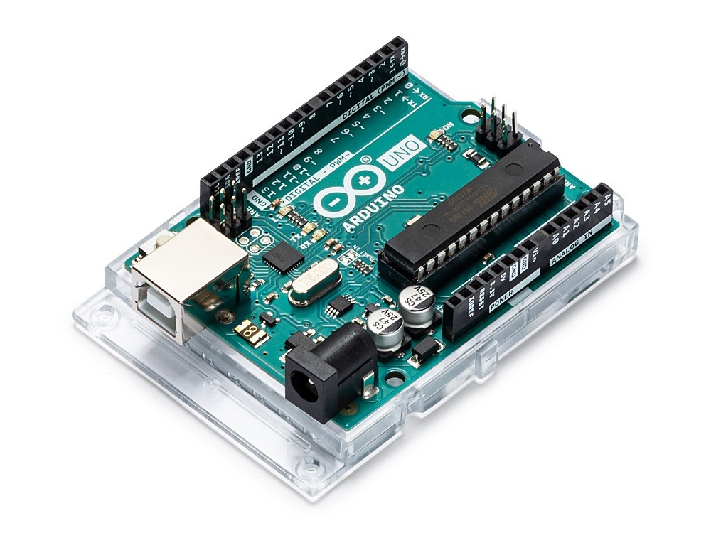
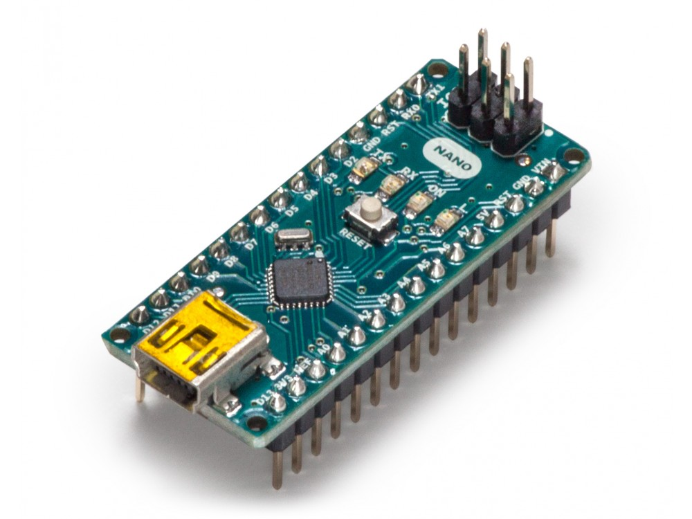
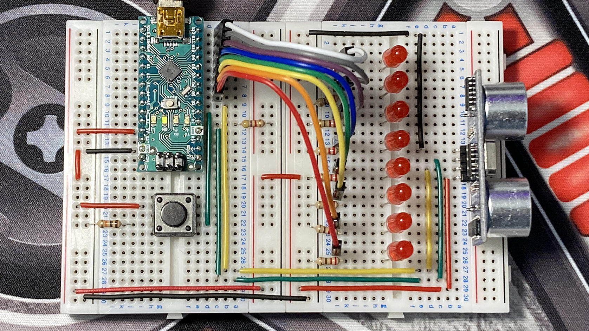
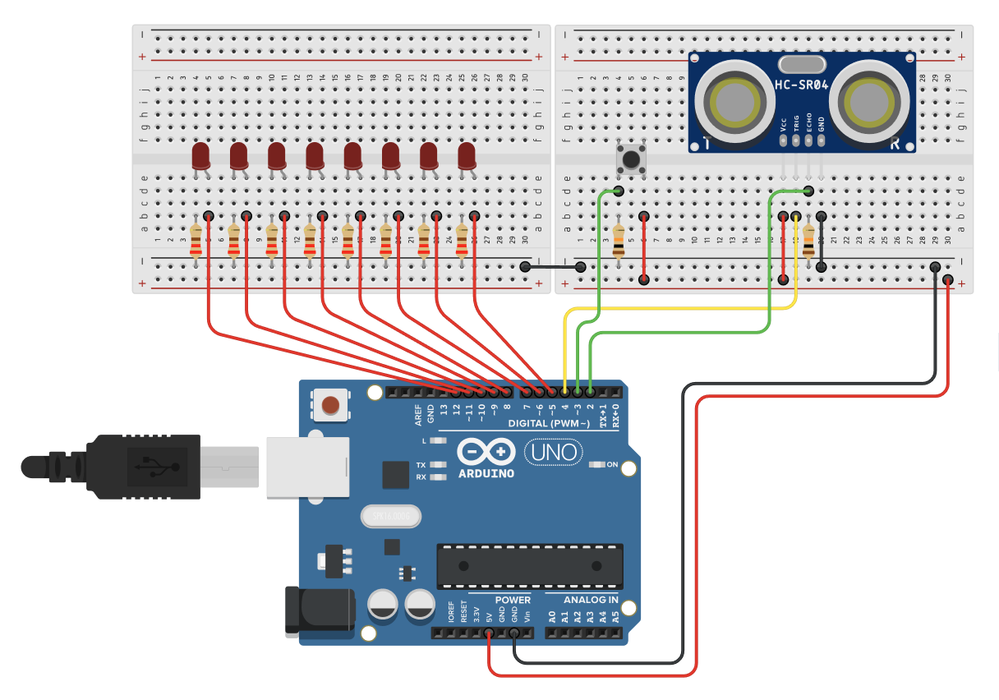
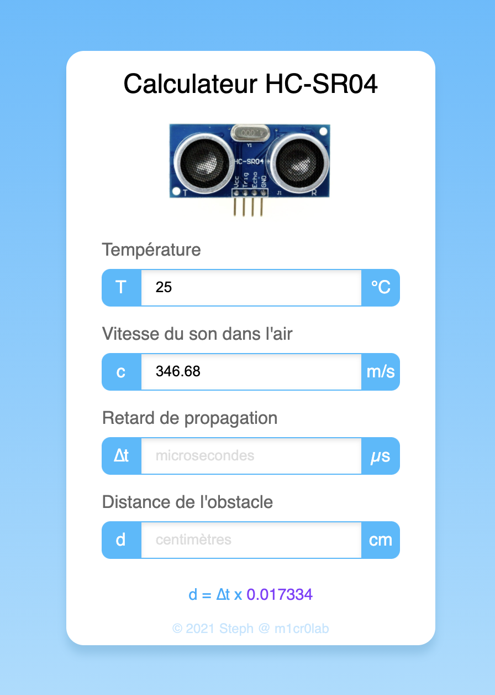

# Registres internes et interruptions de l'ATmega328P

L'objectif de cet atelier est de vous faire découvrir la programmation avancée du micro-contrôleur ATmega328P que l'on retrouve sur les cartes Arduino [Uno][uno-board] et [Nano][nano-board]. Nous nous intéresserons ici aux registres internes et aux vecteurs d'interruption de l'ATmega328P. Autrement dit, le code que nous allons écrire dans le cadre de cet atelier est très spécifique à l'ATmega328P et ne pourra donc fonctionner que sur ce micro-contrôleur.

<table>
    <tbody>
        <tr>
            <td width="66%"></td>
            <td></td>
        </tr>
    </tbody>
</table>


## Réalisation du circuit d'expérimentation

Je vous propose de reprendre le petit circuit électronique que nous avions réalisé dans le cadre de l'atelier sur le [contrôle d'un chenillard à 8 LEDs par un bouton poussoir][chaser], que nous allons adapter et compléter par un transducteur ultrasonique [HC-SR04][hcsr04] pour nous permettre de mesurer des distances en utilisant directement les registres et les vecteurs d'interruption de l'ATmega328P.

<div align="center">
    <br />
    <p></p>
    <p><strong>Circuit à réaliser pour l'atelier</strong></p>
    <br />
</div>

J'utilise ici une carte [Arduino Nano][nano-board], mais vous pouvez tout à fait réaliser le même montage avec une carte [Arduino Uno][uno-board]. Le raccordement des LEDs, du bouton poussoir et du capteur HC-SR04 sur les broches d'entrées-sorties numériques est exactement le même sur ces deux cartes Arduino.

<div align="center">
    <p></p>
    <p><strong>Schéma de câblage du prototype</strong></p>
    <br />
</div>


### Connexion des composants du circuit

- Les anodes de chaque LED sont respectivement reliées aux broches **D12** à **D5** de la carte Arduino. Les cathodes sont reliée à la masse (broche **GND** de la carte Arduino) au travers d'une résistance de **220 Ω** pour limiter l'intensité du courant à environ **15 mA**.

- Le bouton poussoir est inséré entre la broche **D3** et la ligne d'alimentation **5V** de la carte Arduino. La broche de lecture **D3** est également ramenée à la masse (broche **GND** de la carte Arduino) par une résistance **pull-down** de **10 kΩ**.

- Le transducteur HC-SR04, quant à lui, dispose de 4 broches :

    - **VCC** qui est reliée à la ligne d'alimentation **5V** de la carte Arduino,
    - **GND** qui est reliée à la masse (broche **GND** de la carte Arduino),
    - **TRIG** qui est reliée à la broche **D4** de la carte Arduino,
    - **ECHO** qui est reliée :
    
        - à la broche **D2** de la carte Arduino,
        - ainsi qu'à la masse (broche **GND** de la carte Arduino) par une résistance **pull-down** de **10 kΩ**.


## Démonstration

Voici une petite expérimentation que nous allons réaliser dans le cadre d'un exercice, qui met en œuvre l'utilisation du transducteur ultrasonique pour effectuer une mesure graduée de proximité sur la rampe de LEDs :

<div align="center">
    <br />
    <p></p>
    <p><strong>Démonstration du fonctionnement du transducteur HC-SR04</strong></p>
    <br />
</div>


## Documentation technique

Pour la mise en œuvre des exercices qui vous sont proposés dans cet atelier, il vous sera utile de vous référer aux documentations suivantes :

- [Documentation technique de l'ATmega328P][atmega]
- [Plans détaillés des entrées-sorties de la carte Arduino Uno][uno-pinout]
- [Plans détaillés des entrées-sorties de la carte Arduino Nano][nano-pinout]
- [Documentation technique du transducteur HC-SR04][hcsr04]


## Interprétation des données provenant du transducteur ultrasonique

Le transducteur HC-SR04 fournit en sortie, sur sa broche **ECHO**, une impulsion dont la durée **∆t** en microsecondes permet de déduire la distance à laquelle se trouve l'objet qui a réfléchi le train d'ondes ultrasoniques à partir de la vitesse du son dans l'air. Cette vitesse varie en fonction de la pression atmosphérique, de la température et, dans de très faibles proportions, de l'humidité de l'air. En supposant que nos expérimentations sont effectuées au niveau de la mer, à pression atmosphérique normale, on peut se contenter d'évaluer la vitesse du son dans l'air en fonction de la température ambiante.

Pour vous faciliter la tâche, j'ai mis à votre disposition un [petit outil en ligne][tool] qui effectue les calculs à votre place. Il fournit notamment la formule de calcul de la distance de l'obstacle en centimètres en fonction de **∆t**. Dans les exercices proposés, nous considérerons que la température ambiante est de **25°C**.

<div align="center">
    <br />
    <p></p>
    <p><strong>Utilisation du transducteur HC-SR04 à 25°C</strong></p>
    <br />
</div>

Ce petit calculateur nous permettra d'implémenter facilement la fonction de conversion `us2cm()` :

```cpp
/**
 * @brief Constante de conversion durée => distance pour le capteur HC-SR04
 * 
 * @note Cette constante permet de calculer la distance d'un obstacle réfléchissant
 *       le train d'ondes ultrasoniques en fonction de sa durée de propagation.
 *       Elle incorpore de manière implicite la vitesse du son dans l'air.
 * 
 *       La constante de conversion que nous utiliserons ici correspond à la
 *       vitesse du son dans l'air à 25°C évaluée à 346.68 m/s.
 */
constexpr float US_TO_CM = .017334f;

/**
 * @brief Conversion durée => distance pour le capteur HC-SR04
 * 
 * @param us Durée de propagation du train d'ondes ultrasoniques exprimée en microsecondes
 * @return   La distance de l'obstacle réfléchissant exprimée en centimètres
 */
float us2cm(float us) {
    return us * US_TO_CM;
}
```


## Configuration du projet PlatformIO

La configuration du projet est définie par les directives inscrites dans le fichier `platformio.ini` :

```ini
; --------------------------------------------------------------------------------
; Atelier de programmation Robotic 974
; © 2021 Stéphane Calderoni
; --------------------------------------------------------------------------------
; Registres internes et interruptions de l'ATmega328P
; --------------------------------------------------------------------------------
[env:workshop]
platform      = atmelavr
board         = nanoatmega328new
framework     = arduino
monitor_speed = 9600
```

Le projet est ici configuré pour être téléversé sur une carte Arduino **Nano**. Si, de votre côté, vous utilisez une carte Arduino **Uno**, vous devez remplacer la désignation de la carte `board` par la valeur `uno` :

```ini
board = uno
```


## Organisation des codes sources

Les solutions des exercices se trouvent dans le répertoire `src` :

```
src
├── 01-blink.cpp
├── 02-switch.cpp
├── 03-switch-int-v1.cpp
├── 04-switch-int-v2.cpp
├── 05-binary-counter-v1.cpp
├── 06-binary-counter-v2.cpp
├── 07-hc-sr04.cpp
├── 08-hc-sr04-button.cpp
└── 09-proximity-sensor.cpp
```

Chaque fichier doit être compilé en excluant tous les autres avec la directive `src_filter` dans le fichier de configuration `platformio.ini`. Par exemple, pour compiler la solution de l'exercice n°9 :

```ini
; --------------------------------------------------------------------------------
; Atelier de programmation Robotic 974
; © 2021 Stéphane Calderoni
; --------------------------------------------------------------------------------
; Registres internes et interruptions de l'ATmega328P
; --------------------------------------------------------------------------------
[env:workshop]
platform      = atmelavr
board         = nanoatmega328new
framework     = arduino
monitor_speed = 9600
src_filter    = -<*> +<09-proximity-sensor.cpp>
```


## Exercices


### 1. Clignotement d'une LED

Faire clignoter la LED connectée à la broche **D12** à la manière de l'instruction suivante :

```cpp
digitalWrite(12, millis() % 1024 < 512);
```

***Solution** : [01-blink.cpp][s01]*


### 2. Commande d'une LED à l'aide d'un bouton

Allumer la LED connectée à la broche **D12** lorsqu'on appuie sur le bouton poussoir, et l'éteindre lorsqu'on relâche le bouton. Autrement dit, cela revient à réécrire :

```cpp
digitalWrite(12, digitalRead(3));
```

***Solution** : [02-switch.cpp][s02]*


### 3. Commande d'une LED à l'aide d'un bouton par interruption

Allumer puis éteindre alternativement la LED connectée à la broche **D12** à chaque pression sur le bouton poussoir. On cherchera ici à détecter les pressions sur le bouton par le déclenchement d'une interruption armée par la fonction `attachInterrupt()`.

*Remarque : on ne cherchera pas ici à supprimer l'effet rebond.*

***Solution** : [03-switch-int-v1.cpp][s03]*


### 4. Commande d'une LED à l'aide d'un bouton - usage direct d'un vecteur d'interruption

Même exercice que le précédent mais, cette fois, sans utiliser la fonction `attachInterrupt()`. On lui préfèrera l'usage direct du vecteur d'interruption `INT1`, activé par la broche **D3**.

*Remarque : on ne cherchera pas ici à supprimer l'effet rebond.*

***Solution** : [04-switch-int-v2.cpp][s04]*


### 5. Affichage d'un compteur binaire sur 8 LEDs incrémenté par un bouton poussoir

Incrémenter un compteur entier codé sur 8 bits à chaque pression sur le bouton poussoir, et afficher sa valeur binaire sur l'octet représenté par les 8 LEDs.

*Remarque : on ne cherchera pas ici à supprimer l'effet rebond.*

***Solution** : [05-binary-counter-v1.cpp][s05]*


### 6. Compteur binaire avec gestion des rebonds

Même exercice que le précédent mais, cette fois, cherchez à éliminer l'effet rebond.

***Solution** : [06-binary-counter-v2.cpp][s06]*


### 7. Mesures périodiques avec le transducteur HC-SR04

Lancer une séquence de mesures de distances à l'aide du transducteur ultrasonique. Les mesures doivent être effectuées périodiquement à une fréquence de **10 Hz** (une mesure toutes les **100 ms**). Les distances mesurées devront être affichées sur le moniteur série, au fil de l'eau.

Pour cet exercice, vous devrez utiliser le vecteur d'interruption **INT0** qui surveille la broche de lecture **D2** reliée à la broche **ECHO** du HC-SR04. Chaque mesure est initiée en maintenant la broche **D4** (qui est reliée à la broche **TRIG** du HC-SR04) au niveau **HIGH** pendant **10 µs**.

N'oubliez pas d'[établir la formule de conversion durée => distance][toolref] à l'aide du calculateur que j'ai mis à votre disposition.

***Solution** : [07-hc-sr04.cpp][s07]*


### 8. Mesure de distance commandée par un bouton avec le transducteur HC-SR04

Même exercice que le précédent mais, cette fois, en déclenchant une mesure à chaque pression sur le bouton poussoir.

*Remarque : on ne cherchera pas ici à supprimer l'effet rebond.*

***Solution** : [08-hc-sr04-button.cpp][s08]*


### 9. Détecteur de proximité

<table>
    <tbody>
        <tr>
            <td>
                Réaliser un détecteur de proximité avec le transducteur HC-SR04. Le détecteur doit permettre d'afficher sur la rampe de LEDs une mesure graduée de la proximité d'un obstacle se trouvant dans l'intervalle <strong>[4,20] cm</strong>. Plus l'obstacle est proche et plus on allume de LEDs. Inversement, plus l'obstacle est éloigné et moins on allume de LEDs.
            </td>
            <td width="50%"></td>
        </tr>
    </tbody>
</table>

***Solution** : [09-proximity-sensor.cpp][s09]*


[chaser]:      https://github.com/Robotic974/led-chaser-with-button
[hcsr04]:      http://www.microsann.com/images/Atelier_Robotique/Documentation/Fiche_capteur_HC.pdf
[nano-board]:  https://store.arduino.cc/arduino-nano
[uno-board]:   https://store.arduino.cc/arduino-uno-rev3
[atmega]:      https://ww1.microchip.com/downloads/en/DeviceDoc/Atmel-7810-Automotive-Microcontrollers-ATmega328P_Datasheet.pdf
[uno-pinout]:  https://content.arduino.cc/assets/Pinout-UNOrev3_latest.pdf
[nano-pinout]: https://content.arduino.cc/assets/Pinout-NANO_latest.pdf
[tool]:        https://robotic974.m1cr0lab.com/ultrasonic-sensor/
[toolref]:     #interprétation-des-données-provenant-du-transducteur-ultrasonique
[s01]:         src/01-blink.cpp
[s02]:         src/02-switch.cpp
[s03]:         src/03-switch-int-v1.cpp
[s04]:         src/04-switch-int-v2.cpp
[s05]:         src/05-binary-counter-v1.cpp
[s06]:         src/06-binary-counter-v2.cpp
[s07]:         src/07-hc-sr04.cpp
[s08]:         src/08-hc-sr04-button.cpp
[s09]:         src/09-proximity-sensor.cpp